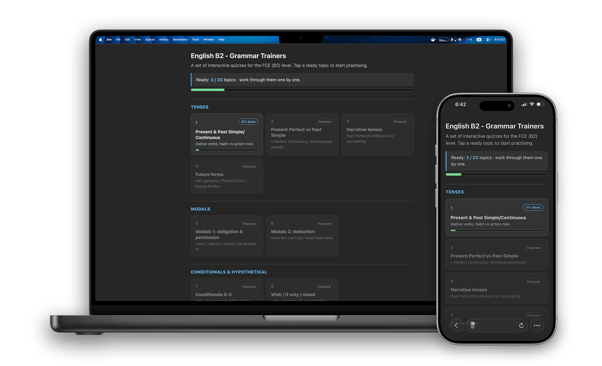

# cram

A local web app for cramming any subject as quizzes. A small [axum] server renders quiz pages with [maud] + [htmx] (almost no hand-written JavaScript); both the index roadmap and the quizzes themselves are defined in TOML files, and per-question progress is stored in SQLite.

The bundled example is a set of English B2 (FCE) grammar trainers, but nothing is tied to that topic - point the TOML files at whatever you need to memorise.

<p align="center">
  
</p>

## Features

- Content is plain TOML: define the index roadmap and every quiz as files, no code changes
- Topic roadmap on the index page with a mastery bar per topic
- Multiple-choice and free-text questions, reshuffled on every reload
- A question drops out after 5 correct answers in a row; stars show the streak
- Per-topic "reset progress"
- Opens the index in your browser on start and logs a LAN URL to open from a phone
- Keeps the machine awake while serving so it stays reachable

## Requirements

- A recent stable **Rust** toolchain (2024 edition; built with 1.97) and `cargo`
- **`make`** to run the Makefile targets below (macOS ships it with the Xcode Command Line Tools; most Linux distros have it; on Windows use WSL). You can skip it and run the underlying `cargo` commands directly instead.
- Optional, only for the database/test `make` targets:
  - `cargo install sqlx-cli` - migrations and offline query metadata
  - `cargo install cargo-nextest` - the test runner used by `make test`

The compiled sqlx query cache (`.sqlx/`) is committed, so a plain build needs no database connection.

## Setup

```bash
cp cram.toml.example cram.toml
```

By default the database is created under the platform data dir on first run (macOS `~/Library/Application Support/cram/cram.db`, Linux `~/.local/share/cram/cram.db`), so no path needs configuring. Set `database_url` in `cram.toml` only to override that location.

The `make` targets that touch the database (`migrate`, `prepare`, `dev`, `test`) use compile-time sqlx macros and still need a `.env`. Copy the example; its `DATABASE_URL` uses `${HOME}`, so no path editing is needed on most machines:

```bash
cp .env.example .env
```

## Build and run

Using the Makefile (run `make help` to list every target):

```bash
make run        # build and run in release mode
make dev        # run in debug mode (loads .env)
make release    # build a release binary and copy it to ./cram (dev)
make install    # bundle binary + files to ~/.cargo/cram + symlink cram onto PATH
make build      # debug build
make lint       # clippy, warnings treated as errors
make fmt        # check and apply formatting
make migrate    # apply pending migrations
```

Or plain cargo from the project root:

```bash
cargo run
```

On start the server prints a local and a LAN URL and opens the index in your default browser; open the LAN URL on a phone connected to the same Wi-Fi.

The `quizzes_dir`, `roadmap_file` and `web_dir` paths in `cram.toml` are resolved against the working directory. When the working directory has no `cram.toml`, they resolve against the directory the binary itself lives in instead. So a built binary runs either from the repo (`make release` copies it to `./cram`; run `./cram` there) or installed system-wide, as below.

## Install

> [!IMPORTANT]
> This is the final step to start using `cram` day to day.

```bash
cp cram.toml.example cram.toml   # once, if you do not have it yet
make install                     # build + bundle into ~/.cargo/cram, link onto PATH
cram                             # now runs from any directory
```

`make install` bundles the release binary with your working `cram.toml`, `quizzes/`, `roadmap.toml` and `web/` into `~/.cargo/cram/`, then symlinks `cram` into `~/.cargo/bin` (already on `PATH` when Rust is installed). The binary finds its files next to itself, so it runs from anywhere, and it carries your real `cram.toml`, so the installed server shares that config, including its `database_url`. Re-run `make install` to update, and uninstall by removing `~/.cargo/cram` and the `~/.cargo/bin/cram` symlink.

## Layout

```
src/            server: lib.rs (bootstrap) + main.rs (entry point)
  config.rs     config loading (cram.toml) + exe-dir anchoring
  db/           SQLite pool, migrations, progress queries
  error.rs      error types
  models/       quiz and roadmap TOML models
  render.rs     HTML rendering (maud)
  route.rs      HTTP routes and handlers
quizzes/        one TOML file per quiz
roadmap.toml    index topics grouped into sections
web/            static assets (style.css, htmx.min.js)
migrations/     SQLite schema
```

[axum]: https://github.com/tokio-rs/axum
[maud]: https://maud.lambda.xyz
[htmx]: https://htmx.org
